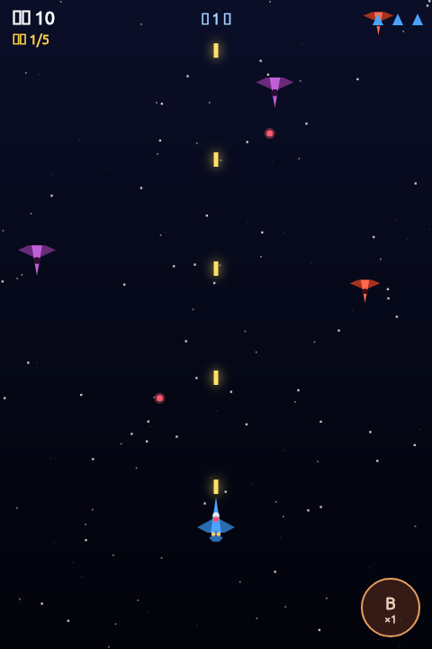

# Airplane Shooter ✈️

[中文](README.md) | English

A vertical-scrolling shoot-'em-up built from scratch with **HTML5 Canvas + vanilla JavaScript**. No frameworks, no build step, no external assets — just open `index.html` in a browser and play.



🎮 **Play online:** <https://gyb.github.io/airplane/>

---

## ✨ Features

- **Pure canvas drawing**: planes, enemies, bullets and explosions are all drawn with Canvas paths/polygons — zero image assets
- **Fair dual control**: keyboard and mouse/touch move at the same capped speed; the player's hitbox is a tiny "core" far smaller than the ship, so wing/nose grazes don't kill you
- **5-level firepower**: single → twin → 3-way → 4-way spread → 5-way wide spread; power decays over time to keep pickups meaningful
- **Three enemy types**: scout / fighter (aimed shots) / heavy (bullet-fan barrage)
- **Boss fights**: spawns at a score threshold, descends and hovers with a patrol pattern, three attack phases, health bar; drops P/S/B on defeat
- **Active skills**: bomb (screen/bullet clear) / shield (6s invulnerability)
- **Wave-based difficulty curve**: a new wave every 18s — enemies get denser, faster, and heavier
- **Synthesized SFX + dual BGM**: calm Canon (D major) normally, an original D-minor battle theme during boss fights — all generated with the Web Audio API
- **Persistent high score**: saved in `localStorage` with a "new record" callout
- **Pause / mute**: `P` to pause, `M` to mute
- **Responsive**: adapts to desktop and mobile with multi-touch support

---

## 🚀 Quick Start

No dependencies to install — pick either option:

**Option A: Open directly**
```
Double-click index.html to open it in a browser.
```

**Option B: Local server** (optional, handy for hot-reloading)
```bash
python3 -m http.server 8000
# visit http://localhost:8000
```

> Use a modern browser (Chrome / Edge / Firefox). Audio unlocks after you click/press a key to start (browser autoplay policy).

---

## 🎮 Controls

| Action | Keyboard | Mouse | Touch |
|--------|----------|-------|-------|
| Move | Arrow keys / WASD | Follow pointer (speed-capped) | One-finger drag |
| Fire | Auto-fire | Auto-fire | Auto-fire |
| Bomb 💣 | `Space` / `X` | **Left-click anywhere** | Second finger tap anywhere / tap the bottom-right button |
| Pause ⏸ | `P` / `Esc` | `P` / `Esc` | — |
| Mute 🔇 | `M` | `M` | — |
| Start / Restart | Any key | Click | Tap |

Design note: **movement and bombing are decoupled** — on mouse ("move = position, left-click = bomb") and on touch ("first finger = position, second finger = bomb"), so releasing a bomb never interrupts your movement.

---

## 🧩 Gameplay

**Pickups** (dropped by enemies / boss)
- 🟡 **P** — firepower +1 (max level 5; extra picks at max give bonus score; decays if you stop collecting)
- 🟢 **S** — shield, 6s invulnerability
- 🟠 **B** — bomb +1 (max 3; extra picks at max give bonus score)

**Enemies**
- 🟥 Scout — fast, fragile, doesn't shoot
- 🟪 Fighter — 3 HP, fires aimed shots (stops firing once it passes you)
- 🟩 Heavy — 7 HP, 5-way bullet fan, higher drop rate

**Boss**: appears when your score crosses the threshold (default 1200), with three escalating phases (single → 3-way → 5-way fan). Defeating it drops one each of P/S/B plus a big score reward.

---

## 📁 Project Structure

```
airplane/
├── index.html   # page skeleton + <canvas>
├── style.css    # centered layout, responsive scaling, touch handling
└── game.js      # all game logic
```

`game.js` is organized into clear sections for readability and extension:

| Section | Responsibility |
|---------|----------------|
| `CONFIG` | every tunable value (sizes / speeds / odds / HP / BPM…) lives here |
| `ENEMY_TYPES` / `POWERUP_TYPES` / `FIRE_PATTERNS` | enemy / pickup / firepower data |
| `AUDIO` | Web Audio SFX synthesis + dual-track BGM scheduler |
| `INPUT` | unified keyboard / mouse / multi-touch input |
| `STATE` | state machine (MENU / PLAYING / PAUSED / GAMEOVER) |
| `ENTITY` | Player / Bullet / Enemy / EnemyBullet / PowerUp / Boss |
| `UPDATE` / `RENDER` / `LOOP` | per-frame logic & drawing, `requestAnimationFrame` loop |

---

## 🔧 Tuning & Extension

All values live in the `CONFIG` object at the top of `game.js` — adjust game feel without hunting through code, e.g.:

- `player.speed` / `fireInterval` — movement and fire rate
- `player.hitW` / `hitH` — hitbox core size (smaller = more hardcore)
- `enemy.spawnInterval` / `wave.duration` — spawn density and wave pacing
- `boss.firstScore` / `baseHp` — boss timing and health
- `skills.shieldDuration` / `bombDamage` — skill strength
- `BGM_BPM` / `BOSS_BPM` — music tempo

Adding content (new enemies, bullet patterns, pickups) is just a new entry in the relevant data table plus a branch where needed.

---

## 🛠 Tech Stack

- **Rendering**: HTML5 Canvas 2D (`requestAnimationFrame` + frame-rate normalization)
- **Audio**: Web Audio API (oscillator + noise synthesized SFX; lookahead-scheduled looping BGM)
- **Storage**: `localStorage` (high score)
- **Dependencies**: none. No npm, no bundler, no framework.

---

## 📄 License

Personal learning / hobby project — feel free to use and modify the code.
