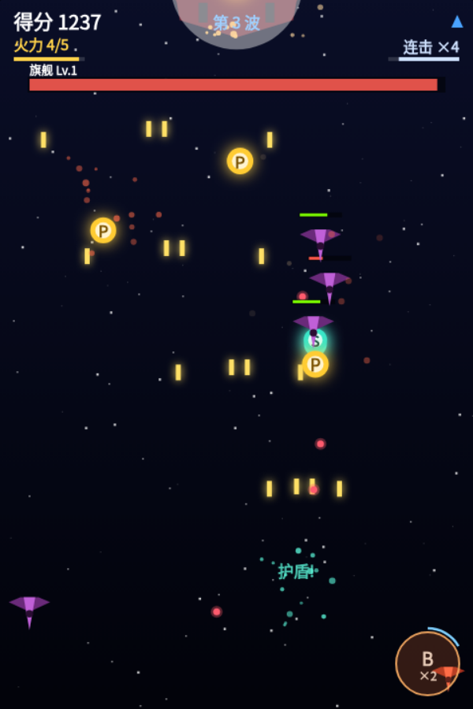

# 飞机大战 ✈️

[English](README.en.md) | 中文

一款用 **HTML5 Canvas + 原生 JavaScript** 从零实现的竖屏卷轴射击游戏。无框架、无构建步骤、无外部资源依赖——浏览器打开 `index.html` 即可运行。



🎮 在线试玩：<https://gyb.github.io/airplane/> · [双人版（仅电脑）](two-player/)

---

## 👥 双人版（仅电脑）

[在线试玩](two-player/) · 本地打开 `two-player/index.html`

在单人版基础上 fork 的双人合作变体（`two-player/game.js` 独立副本，与单人版互不影响）：

- **P1 键盘**：方向键 / WASD 移动，`Space` / `X` 炸弹（蓝色机）
- **P2 鼠标**：移动跟随，左键炸弹（银白机）
- 双机自动开火、无友军伤害；**敌机与 Boss 瞄准距离最近的玩家**，自爆机随机锁定一人
- **道具谁碰到归谁**：火力 / 僚机 / 炸弹库存 / 护盾各自独立——抢道具即乐趣
- **分数 / 连击 / 擦弹攒槽全队共享**（任一人中弹连击即断），结算页分开统计两人击破与擦弹
- **生命各 3 条**：一机坠毁后另一机继续，全灭才结束
- 刷怪密度按双倍火力补偿性上调（`CONFIG.duo.spawnMul`）；最高分为独立榜单（不与单人版混算）
- 双人版不支持触屏；单人版后续更新需手动同步至此副本

---

## ✨ 特性

- **纯图形绘制**：飞机、敌机、子弹、爆炸粒子全部用 Canvas 路径/多边形画出，零图片素材
- **公平双控**：键盘与鼠标/触摸速度对等；玩家受击用远小于机身的「判定核」，擦翼尖不死
- **5 级火力**：单发 → 双发 → 三向 → 四发散射 → 五向宽散射；火力会随时间衰减，鼓励持续拾取
- **僚机系统**：火力满级后再吃 P 逐台转化僚机（最多 2 台，阻尼跟随、随主炮同步开火），满员再吃给奖励分；中弹时全部损毁
- **五种敌机**：侦察机 / 战斗机（瞄准开火）/ 重型机（扇形弹幕）/ 自爆机（锁定俯冲）/ 悬浮炮（悬停扫射）
- **敌机编队**：V 字楔形 / 纵列 / 侧向突入 / 横排封锁线（必留缺口）随波次解锁，穿插在单架刷怪之间
- **Boss 关**：三种 Boss 按等级轮换——旗舰（定向弹幕）/ 环堡（整圈+螺旋弹幕）/ 掠袭者（冲刺突袭+沿途撒弹），三阶段强化、血条，击败掉落 P/S/B
- **主动技能**：炸弹（清屏清弹）/ 护盾（6 秒免伤）
- **受击反馈**：中弹时震屏 + 红闪 + 殉爆粒子 + 飘字明示损失，并获得短暂缓冲护盾喘息
- **波次难度曲线**：每 18 秒推进一波，敌机更密更快、组合偏重型
- **合成音效 + 四轨 BGM**：平时卡农（D 大调），每个 Boss 一首专属战斗曲——旗舰 D 小调进行曲 / 环堡沉重压迫曲 / 掠袭者 E 小调追击曲，全程 WebAudio 合成
- **连击得分**：1.8 秒内持续击破累积连击，击杀得分倍率最高 ×3；中弹清零、炸弹击杀照常计入，结算页展示击破数 / 最大连击 / 用时
- **擦弹得分**：敌弹擦过机身（判定核外的擦弹圈）即得分，护盾期照常累积；每擦 30 次奖励 1 颗炸弹（满库存转奖励分），进度显示为炸弹按钮外的青色圆弧
- **最高分持久化**：`localStorage` 保存，破纪录有提示
- **暂停 / 静音**：`P` 暂停、`M` 静音
- **响应式**：自适应桌面与移动端，支持多点触控

---

## 🚀 快速开始

无需安装任何依赖，两种方式任选：

**方式一：直接打开**
```
双击 index.html，用浏览器打开即可。
```

**方式二：本地服务器**（可选，热更新更方便）
```bash
python3 -m http.server 8000
# 浏览器访问 http://localhost:8000
```

> 推荐 Chrome / Edge / Firefox 等现代浏览器。音效需要点击/按键开始游戏后才会解锁（浏览器自动播放策略）。

---

## 🎮 操作方式

| 操作 | 键盘 | 鼠标 | 触摸 |
|------|------|------|------|
| 移动飞机 | 方向键 / WASD | 移动鼠标跟随（限速） | 单指拖动跟随 |
| 开火 | 自动开火 | 自动开火 | 自动开火 |
| 释放炸弹 💣 | `Space` / `X` | **左键任意位置点击** | 第二指任意位置落下 / 点右下角按钮 |
| 暂停 ⏸ | `P` / `Esc` | `P` / `Esc` | — |
| 静音 🔇 | `M` | `M` | — |
| 开始 / 重新开始 | 任意键 | 点击 | 触摸 |

设计要点：**走位与放炸弹解耦**——鼠标「移动 = 走位、左键 = 炸弹」，触屏「第一指 = 走位、第二指 = 炸弹」，互不干扰，放炸弹时不会中断走位。

---

## 🧩 玩法要素

**道具**（敌机击毁 / Boss 击败掉落）
- 🟡 **P** 火力 +1（最高 5 级；满级再吃先转化为僚机，僚机满 2 台后给奖励分；不拾取会随时间降级）
- 🟢 **S** 护盾，6 秒免伤
- 🟠 **B** 炸弹 +1（最高 3 颗；满库存再吃给奖励分）

**敌机**
- 🟥 侦察机：快、脆、不开火
- 🟪 战斗机：3 血，向玩家瞄准开火（越过玩家后不再开火）
- 🟩 重型机：7 血，5 发扇形弹幕，掉落率更高
- 🟧 自爆机：1 血，从屏幕侧翼贴着玩家高度横向逼近（躲在垂直火力线下方，自动火力打不到），接近后锁定当前位置、闪烁蓄力约 0.3 秒冲刺（冲向锁定点不追踪，移动可躲）
- ⬜ 悬浮炮：20 血小型炮台，入场悬停约 8 秒发射旋转环形弹幕（开火前有红色充能警示环），随后加速撤离；高波次登场，值得优先集火

**Boss（三种按等级轮换）**：累计分数到门槛（默认 1200，间隔逐次等差递增）登场，血量随等级增长，三阶段逐步强化，击败掉落 P/S/B 各一个 + 大额分数。

**连击**：1.8 秒内连续击破敌机即累积连击，击杀得分按 `1 + 连击数 × 0.1` 加成（封顶 ×3）。中弹清零；炸弹击杀照常计入（把保命资源换成连击爆发的博弈）；Boss 击破是保底分、不进连击。

**擦弹**：敌弹进入判定核外的擦弹圈（约机身范围）每颗计一次，+10 分；护盾/无敌期间照常累积——贴弹飞行是高风险高回报。每擦 30 次奖励 1 颗炸弹（满库存转 100 奖励分）。
- 🟥 **旗舰**：左右巡航，定向弹幕——单发瞄准 → 三向 → 五向宽扇 + 双垂直弹
- 🟦 **环堡**：环形要塞缓慢漂移（血少漂快），全向弹幕——整圈旋转 → 双圈交错 → 双臂螺旋流 + 高密圈弹；血量更厚（站位固定、火力全中）
- 🟪 **掠袭者**：蓄力闪烁预警后横向冲刺（撞击威胁大），冲刺沿途撒弹形成横墙，停顿瞬间是输出窗口；血量较薄（一直在动）

---

## 📁 项目结构

```
airplane/
├── index.html   # 页面骨架 + <canvas>
├── style.css    # 居中布局、响应式缩放、触摸手势处理
├── game.js      # 全部游戏逻辑（单人版）
└── two-player/  # 双人版（fork 自 game.js 的独立副本）
    ├── index.html
    └── game.js
```

`game.js` 内部分区清晰，便于阅读和扩展：

| 区块 | 职责 |
|------|------|
| `CONFIG` | 所有可调参数（尺寸/速度/概率/血量/BPM…）集中于此 |
| `ENEMY_TYPES` / `POWERUP_TYPES` / `FIRE_PATTERNS` / `FORMATIONS` | 敌机 / 道具 / 火力编排 / 编队数据 |
| `AUDIO` | WebAudio 音效合成 + 双曲目 BGM 调度 |
| `INPUT` | 键盘 / 鼠标 / 多点触摸统一输入 |
| `STATE` | 状态机（MENU / PLAYING / PAUSED / GAMEOVER） |
| `ENTITY` | Player / Bullet / Option / Enemy / EnemyBullet / PowerUp / Boss |
| `UPDATE` / `RENDER` / `LOOP` | 每帧逻辑与绘制、`requestAnimationFrame` 主循环 |

---

## 🔧 调参与扩展

所有数值都集中在 `game.js` 顶部的 `CONFIG` 对象，无需翻代码即可调整游戏手感，例如：

- `player.speed` / `fireInterval` — 移动与射速
- `option.maxCount` / `followEase` — 僚机数量与跟随手感
- `player.hitW` / `hitH` — 判定核大小（越小越硬核）
- `enemy.spawnInterval` / `wave.duration` — 刷怪密度与波次节奏
- `formation.chance` / `cooldown` — 编队触发概率与间隔
- `combo.window` / `maxCount` — 连击窗口与倍率封顶
- `graze.radius` / `bombEvery` — 擦弹圈大小与攒槽阈值
- `boss.firstScore` / `gapScore` / `gapStep` — Boss 登场门槛与逐级等差递增的间隔
- `skills.shieldDuration` / `bombDamage` — 技能强度
- `player.hurtShieldDuration` / `hurtShake` — 受击缓冲护盾与震屏强度
- `BGM_BPM` / `FLAG_BPM` / `RING_BPM` / `RAM_BPM` — 各曲目速度

新增内容（新敌机、新弹幕、新道具）只需在对应数据表里加条目并在相关分支处理。

---

## 🛠 技术栈

- **渲染**：HTML5 Canvas 2D（`requestAnimationFrame` + 帧率归一化）
- **音频**：Web Audio API（振荡器 + 噪声合成音效；lookahead 调度的循环 BGM）
- **存储**：`localStorage`（最高分）
- **依赖**：无。无 npm、无打包、无框架。

---

## 📄 许可

个人学习 / 娱乐项目，代码可自由取用与修改。
